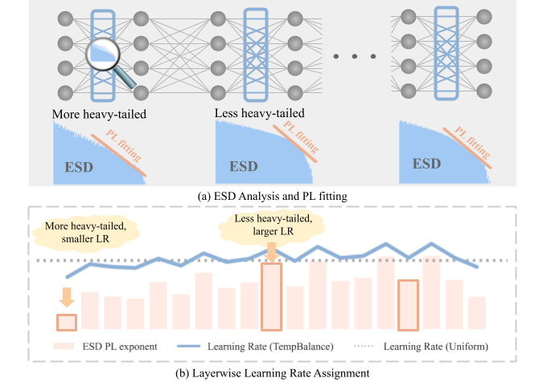
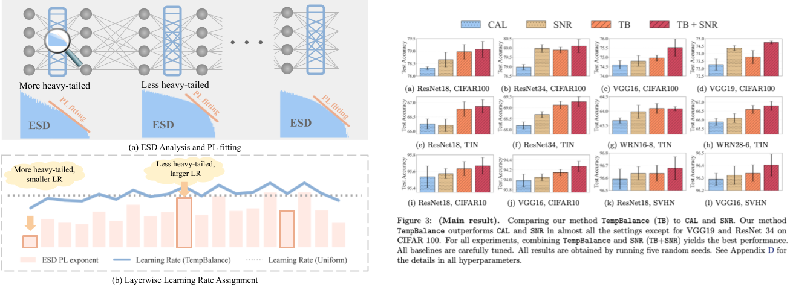

# Temperature Balancing, Layer-wise Weight Analysis, and Neural Network Training [NeurIPS 2023 Spotlight]

[Yefan Zhou](https://yefanzhou.github.io/), Tianyu Pang, [Keqin Liu](https://math.nju.edu.cn/szdw/apypl1/20221121/i231998.html), Charles H. Martin, [Michael W. Mahoney](https://www.stat.berkeley.edu/~mmahoney/), [Yaoqing Yang](https://sites.google.com/site/yangyaoqingcmu/)

[Full paper](https://openreview.net/forum?id=oyV9FslE3j)

## Introduction
Temperature Balancing is a "model diagnostic" based layer-wise adaptive learning rate scheduler.
Most deep neural networks have complex multilayer structures, often seen as a barrier to transparency. 
In our research, we reveal a significant insight: these layers are not uniformly well-trained. 
Our approach introduces a "model diagnostic" tool to identify underperforming layers, and address them by adjust layer-wise learning rate for improved training.
We demonstrate its effectiveness across various benchmarks, datasets, and network architectures, outperforming more than five existing methods, all rooted in our ability to dissect and diagnose network imbalances.
<!--
-->
<p align="center">

</p>


## Dataset and Environment Setup

```bash
conda create -n ww_train python=3.8
conda activate ww_train
pip install -r requirements.txt

# install TinyImageNet
export data_path=PATH_TO_DATA
bash dataset_setup.sh
```

## Usage
```python
from tempbalance import Tempbalance
import torch
model = ...
# initialize the scheduler
tb_scheduler = Tempbalance(net=net, 
                lr_min_ratio=0.5,
                lr_max_ratio=1.5
                )
# initialize optimizer parameter group
tb_param_group = tb_scheduler.build_optimizer_param_group(untuned_lr=0.1)
optimizer = optim.SGD(
    tb_param_group,
    ...
)
# training loop
for epoch in range(1, ...):
    ...
    train()
    test()
    # get global decayed learning rate (optimizer lr should not be updated here)
    untuned_global_lr = some_lr_decay_function(epoch)
    # temperature balancing
    tb_scheduler.step(optimizer, untuned_global_lr)
    ...
```

## Experiments 
Set up absolute paths for code repository, and checkpoints.
```bash
export data_path=PATH_TO_DATA
export src_path=PATH_TO_CODE_REPO
export ckpt_src_path=PATH_TO_CKPT
```
### Compare TempBalance (TB) to CAL and SNR
```bash
# CIFAR100
bash bash_scripts/cal_snr/cifar100_tb_snr_cal_baseline.sh

# CIFAR10
bash bash_scripts/cal_snr/cifar10_tb_snr_cal_baseline.sh

# TinyImageNet
bash bash_scripts/cal_snr/tin_tb_snr_cal_baseline.sh

# SVHN
bash bash_scripts/cal_snr/svhn_tb_snr_cal_baseline.sh
```

### Compare TempBalance (TB) to more baseline optimizers
```bash
bash bash_scripts/compare_opts/cifar100_compare_opt.sh
```

### Ablation study 
```bash
# Varying learning rate
bash bash_scripts/ablation/lr_ablation.sh

# Varying model width
bash bash_scripts/ablation/width_ablation.sh

# Varying ESD metric
bash bash_scripts/ablation/metric_ablation.sh
```


## Other tasks
Preliminary implementation of applying TempBalance to [language modeling](https://github.com/YefanZhou/TempBalance/tree/main/language_modeling) and [object detection](https://github.com/YefanZhou/TempBalance/tree/main/object_detection), under development.


## Acknowledgement

We thank the open-sourced packages [weightwatcher](https://github.com/CalculatedContent/WeightWatcher/tree/master), [pytorch-optimizer](https://github.com/jettify/pytorch-optimizer), [adamp](https://github.com/clovaai/AdamP).


## Citation
We would appreciate it if you could cite the following paper if you found the repository useful for your work:

```bash
@inproceedings{zhou2023temperature,
title={Temperature Balancing, Layer-wise Weight Analysis, and Neural Network Training},
author={Yefan Zhou and Tianyu Pang and Keqin Liu and charles h martin and Michael W. Mahoney and Yaoqing Yang},
booktitle={Thirty-seventh Conference on Neural Information Processing Systems},
year={2023}
}
```